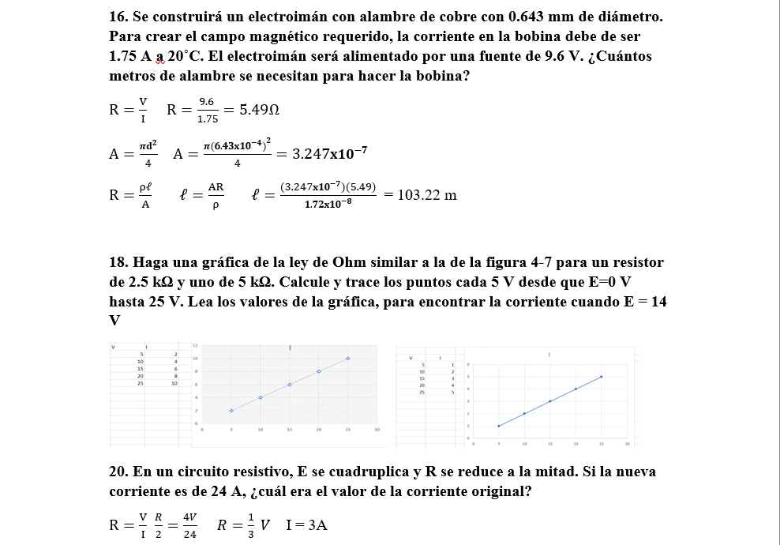

# InformeTarea2

1. OBJETIVOS

☻ Generales:

* Ser capaces de reconocer resistencia y conductancia a profundidad de los conceptos fundamentales.

* Conocer los conceptos básicos sobre Ley de ohm, potencia y energía mediante el estudio de la teoría.

☻Específicos:

* Estudiar los conceptos de corriente, potencia, conductancia y resistencia, mediante la realizacion de ejercición para entender su relación  y reforzar los conocimientos establecidos en clase.

*Estudiar la relación existente entre la resistencia eléctrica de un material y sus características intrínsecas.

2. MARCO TEÓRICO:

3. RESOLUCIÓN Y EXPLICACIÓN DE EJERCICIOS:

Unidad 3

1-31

33-45

Unidad 4

2-14

16-42

4. VDEO:

5. CONCLUSIONES:

* Tras aprender terminología y conocimientos base sobre voltaje, corriente y resistencia somos capaces de aplicarlos sobre circuitos eléctricos.

* Ahora somos capaces de calcular la resistividad de un material a cualquier temperatura.

*  Tras aprender terminología y conocimientos base sobre voltaje, corriente y resistencia somos capaces de aplicarlos sobre circuitos eléctricos.

* Nos dimos cuenta que a menor diametro de un cable, la corriente tiene mayor esfuerzo para pasar.

* Ahora podemos resolver problemas que se nos puede presentar en la vida practica ya sea para la elegir la cantidad de materiales que se necesita o evitar algún contra tiempo por no hacerlo bien.

6. BIBLIOGRAFÍA:

Allan.H.Wilhelm.C.(2008). Análisis de circuitos teoría y práctica. Santa Fe, México: Cengage learning editores.
